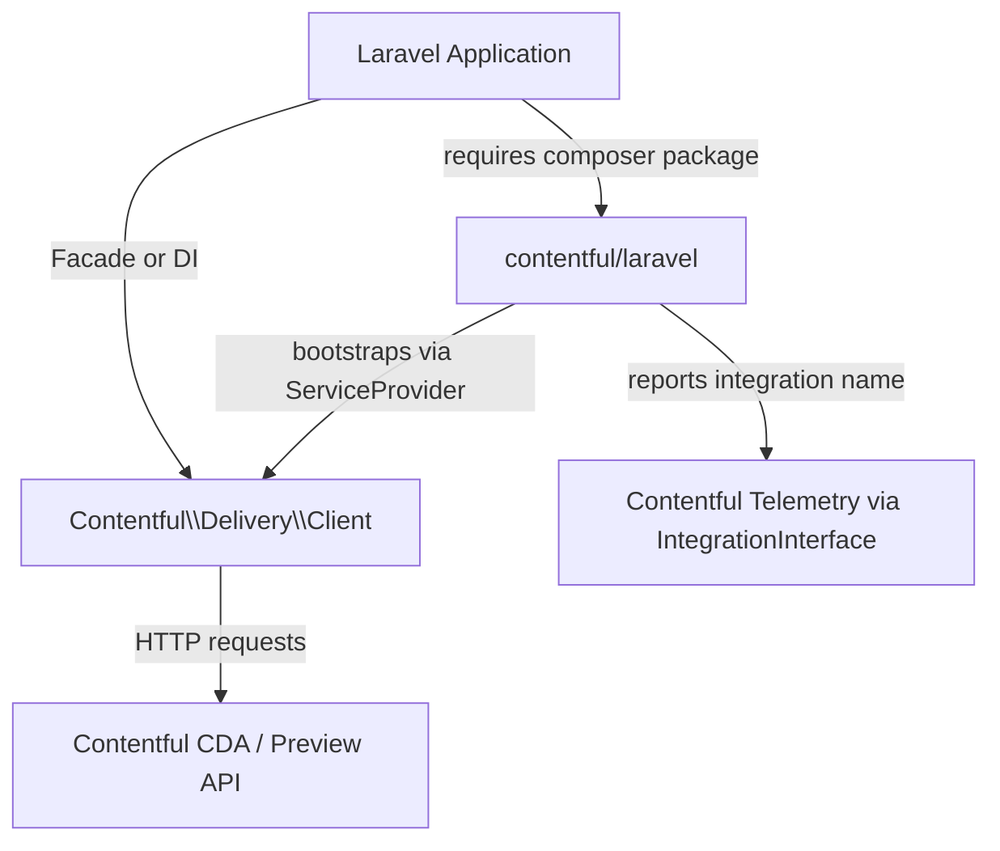

# Architecture

<!-- Generated by seed-golden-context | Last updated: 2026-05-11 -->

## Overview

`contentful/laravel` is a thin Laravel integration package that wires the [Contentful PHP Delivery SDK](https://github.com/contentful/contentful.php) (`contentful/contentful`) into Laravel's service container. It registers a deferred service provider, publishes a config file, and exposes the Contentful `Client` via a `ContentfulDelivery` facade — so Laravel apps can resolve the CDA client via dependency injection or the facade without manual bootstrapping.

This is a **publish-and-forget library** (Tier 4, owned by `group:team-developer-experience`). There is no runtime service, no database, and no background jobs.

## System Context

## Internal Structure

| Path | Purpose |
|---|---|
| `src/ContentfulServiceProvider.php` | Laravel `ServiceProvider` + `IntegrationInterface` implementation. Registers the deferred `Client` singleton, merges config, publishes config file. |
| `src/Facades/ContentfulDelivery.php` | Laravel `Facade` that resolves `Contentful\Delivery\Client` from the service container. |
| `src/config/contentful.php` | Default config template (published to host app's `config/contentful.php` via `php artisan vendor:publish`). |
| `tests/TestCase.php` | Orchestra Testbench base test case, registers the service provider and facade alias. |
| `tests/Unit/ClientTest.php` | Verifies the facade root resolves to a `Client` instance. |
| `tests/Unit/ConfigTest.php` | Verifies config values are accessible from the container. |

## Data Flow

1. **Boot**: `ContentfulServiceProvider::boot()` merges the default config into Laravel's config system and registers the publishable config file.
2. **Register**: `ContentfulServiceProvider::register()` binds a deferred singleton for `Contentful\Delivery\Client`. The singleton is not constructed until first resolution.
3. **First resolve**: When the app resolves `Client` (via DI or `ContentfulDelivery::` facade), the singleton factory reads from `config('contentful.delivery.*')`, constructs a `ClientOptions` instance, and calls `$client->useIntegration($this)` to tag telemetry headers with `contentful.laravel`.
4. **API calls**: All subsequent CDA requests go through the upstream `contentful/contentful` client directly.

## Key Dependencies

| Dependency | Why it's here |
|---|---|
| `contentful/contentful` ^7.0.1 | The upstream PHP Delivery SDK — provides the actual `Client`, `ClientOptions`, and all CDA interaction. See [ADR-001](./docs/ADRs/001-upstream-php-delivery-sdk.md). |
| `contentful/core` ^4.0 | Shared Contentful PHP infrastructure: `IntegrationInterface`, HTTP layer, exception types. |
| `laravel/framework` ^8.0–^13.0 | The host framework this package integrates with. |
| `orchestra/testbench` (dev) | Laravel package testing harness — boots a minimal Laravel app for unit tests without a full application. |
| `phpstan/phpstan` (dev) | Static analysis at level 5. |

## Configuration

All config lives under the `contentful.delivery` namespace (from `config/contentful.php`):

| Variable | Config Key | Purpose | Default |
|---|---|---|---|
| `CONTENTFUL_SPACE_ID` | `contentful.delivery.space` | Contentful space ID | _(required)_ |
| `CONTENTFUL_DELIVERY_TOKEN` | `contentful.delivery.token` | CDA access token | _(required)_ |
| `CONTENTFUL_ENVIRONMENT_ID` | `contentful.delivery.environment` | Environment to query | `master` |
| `CONTENTFUL_USE_PREVIEW` | `contentful.delivery.preview` | Use Preview API instead of Delivery API | `false` |
| `CONTENTFUL_DEFAULT_LOCALE` | `contentful.delivery.defaultLocale` | Default locale for queries | _(none)_ |
| _(callable)_ | `contentful.delivery.options` | Callable `fn(ClientOptions, Application)` for advanced client configuration | `[]` |

## Integration Points

### Upstream (this repo consumes)

- `contentful/contentful` — the PHP Delivery SDK; all CDA/Preview API calls are delegated here
- `contentful/core` — `IntegrationInterface` for telemetry tagging; HTTP/exception infrastructure

### Downstream (consumes this repo)

- **Laravel applications** — any app requiring `contentful/laravel` gets the `ContentfulDelivery` facade and `Client` binding automatically via Laravel's package discovery (`extra.laravel` in `composer.json`)
